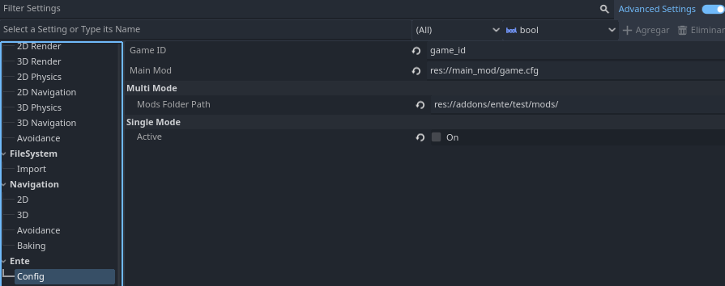
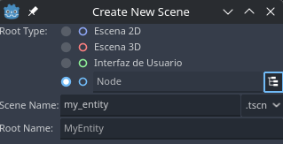
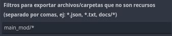

# Quickstart guide for Ente

Guía para utilizar [Ente](https://github.com/adrianlegui/ente).

## 1. Getting Started
Ente es un complemento para **Godot Engine 4** que permite agregar escenas al _SceneTree_ al iniciar el juego, persistir la información de las mismas y cargar mods que modifiquen las escenas del juego.

## 2. Installation

[Documentación de como instalar un complemento](https://docs.godotengine.org/en/stable/tutorials/plugins/editor/installing_plugins.html).

Solo es necesario copiar lo siguiente:
```
addons/ente/plugin.cfg
addons/ente/src
```
Si está usando [gd-plug](https://github.com/imjp94/gd-plug), agregar los siguiente al fichero plug.gd.
```gdscript
plug(
	"adrianlegui/ente",
	{"exclude": ["addons/ente/test", "addons/ente/schema"], "tag": "TAG_A_INSTALAR"}
)
```
Reemplazar ```TAG_A_INSTALAR``` con el nombre del tag que se quiere instalar.

Luego, activar **Ente**.

## 3. Configuration
Activar advance settings para poder configurar __Ente__.



**Main Mod**: ruta al mod principal del juego.

**Game ID**: identificador usado para comprobar mod y partidas guardadas.

**Single Mode**: si está activo, solo se cargará **Main Mod**; en caso contrario se cargará **Main Mod** y todos los mods indicados en _load_order.txt_.

**Multi Mode / Mods Folder Path**: directorio en que se buscará *load_order.txt*, contiene los mods a cargar y el orden de carga de los mismos; mods y ficheros *pck* también se buscarán en el mismo directorio.

## 4. How to use
Crear directorio __main_mod__ en ```res://```.

### 4.1 Creating a persistent Data

Crear una escena llamada __my_entity__ en el directorio ```res://main_mod``` con nodo root de clase Node.



Agregar script a la escena y agregar el nodo raíz al grupo __ENTE_PERSISTENT__.

``` gdscript
extends Node

var my_var: bool = true
```

### 4.2 Configure persistent properties
Ejemplo de como configurar una variable para que sea persistente.

``` gdscript
extends Node

var my_var: bool = true

func ente_get_data() -> Dictionary:
	var data: Dictionary = {}
	data["my_var"] = my_var
	return data


func ente_set_data(data: Dictionary) -> void:
	my_var = data.get("my_var", false)
	
```

### 4.3 Creating Mod
Crear fichero ```game.cfg``` en el directorio ```res://main_mod/```. Agregar al fichero lo siguiente.

``` ini
[MOD]

GAME_ID="game_id"
DEPENDENCIES=[]
PCKS=[]
VERSION="0.0.1"

[PERSISTENT]

```

### 4.4 Add entities
Ejemplo de como agregar entidades a un mod; se utiliza la escena creada antes, *my_entity.tscn*.

``` ini
[MOD]

GAME_ID="game_id"
DEPENDENCIES=[]
PCKS=[]
VERSION="0.0.1"

[PERSISTENT]

MyEntity0={"scene_file_path" : "res://main_mod/my_entity.tscn"}
MyEntity1={
	"scene_file_path" : "res://main_mod/my_entity.tscn",
	"DATA" : {"my_var" : false}
}
```

### 4.5 Start game
Ejemplo de como inicializar **Ente** e iniciar una partida.

``` gdscript
extends Node


func _ready() -> void:
	EnteModManager.start() # Carga los mods y pck
	await EnteModManager.finished # Esperar a que termine de cargar
	
	get_tree().paused = true # Pausa el árbol de nodos.
	EnteModManager.start_game() # Agrega todos las entidades(instancias de escenas) indicados en los mods
	await EnteModManager.started_game # Espera a que se inicie la partida
	get_tree().paused = false # Reanuda el árbol de nodos.
	
```

## 4.6 How to save game
Ejemplo de como guardar una partida.
``` gdscript
EnteModManager.save_game("savegame_name")
```

## 4.7 How to load savegame
Ejemplo de como cargar una partida.
``` gdscript
EnteModManager.load_savegame("savegame_name")
```

### 4.8 Export
Al exportar el proyecto agregar fichero cfg con la configuración de las entidades.

